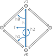
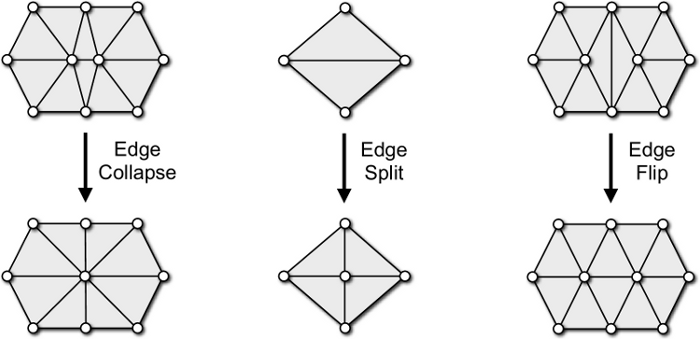

# Tutorial {#tutorial}

This section provides a hands-on tutorial showing the basic usage of PMP. For a
thorough introduction to polygon mesh processing we refer to the book of Botsch
et al. \cite botsch_2010_polygon.

## Introduction

In general, a polygonal surface mesh is composed of vertices, edges and faces as
well as the incidence relationships between them. pmp::SurfaceMesh stores the
connectivity information based on halfedges, i.e., pairs of directed edges with
opposing direction. To be more precise:

- Each vertex stores an outgoing halfedge.
- Each face stores an incident halfedge.
- Each halfedge stores its incident face, its target vertex, and its previous
  and next halfedges within the face.

The halfedge connectivity is illustrated in the figure below:


In the following sections we describe the basic usage of pmp::SurfaceMesh by
means of simple example programs and code excerpts.

## Basics

The very basic usage of pmp::SurfaceMesh is demonstrated in the example below. The
program first instantiates a pmp::SurfaceMesh object as well as four vertex
handles. These handles, as well as the handles for the other mesh entities
`Halfedge`, `Edge` and `Face` basically indices. Four vertices are added to the
mesh, as well as four triangular faces composing a tetrahedron. Finally, the
number of vertices, edges, and faces is printed to standard output.

\snippet basics.cpp basics

## Iterators and Circulators

In order to sequentially access mesh entities pmp::SurfaceMesh provides
iterators for each entity type:

1. pmp::SurfaceMesh::VertexIterator
2. pmp::SurfaceMesh::HalfedgeIterator
3. pmp::SurfaceMesh::EdgeIterator
4. pmp::SurfaceMesh::FaceIterator

Similar to iterators, pmp::SurfaceMesh also provides circulators for the ordered
enumeration of all incident vertices, halfedges, or faces around a given face or
vertex. The example below demonstrates the use of iterators and circulators for
computing the mean valence of a mesh.

\snippet iterators.cpp iterators

## Dynamic Properties

Attaching additional attributes to mesh entities is important for many
applications. pmp::SurfaceMesh supports properties by means of synchronized arrays
that can be (de-)allocated dynamically at run-time. Property arrays are also
used internally, e.g., to store vertex coordinates. The example program below
shows how to access vertex coordinates through the pre-defined point property.

\snippet barycenter.cpp barycenter

The dynamic (de-)allocation of properties at run-time is managed by a set
of four different functions.

- Add a new property of a specific type for a given entity. Example:

  ```cpp
  auto vertex_weights = mesh.add_vertex_property<Scalar>("v:weight");
  ```

- Get a handle to an existing property. Example:

  ```cpp
  auto points = mesh.get_vertex_property<Point>("v:point");
  ```

- Get or add: Return a handle to an existing property if a property of the
  same type and name exists. If there is no such property, a new one is
  allocated and its handle is returned. Example:

  ```cpp
  auto edge_weights = mesh.edge_property<Scalar>("e:weight");
  ```

- Remove a property given its handle:

  ```cpp
  auto face_colors = mesh.face_property<Color>("f:color");
  mesh.remove_face_property(face_colors);
  ```

Functions that allocate a new property take an optional default value for the
property as a second argument. Example:

```cpp
mesh.face_property<Color>("f:color", Color(1.0, 0.0, 0.0));
```

The code excerpt below demonstrates how to
allocate, use and remove a custom edge property.

\snippet properties.cpp edge-properties

In addition to the per-entity properties described above it is also possible to
attach global per-object properties to a mesh. This can be used, e.g., for
storing minimum or maximum values of a scalar field or for storing a set of
region markers present in the mesh:

\snippet properties.cpp global-properties

Note in the above that access to the object property simply uses a zero index
since there is no concept of an object handle.

## Connectivity Queries

Commonly used connectivity queries such as retrieving the next
halfedge or the target vertex of an halfedge are illustrated below.

```cpp
Halfedge h;
auto h0 = mesh.next_halfedge(h);
auto h1 = mesh.prev_halfedge(h);
auto h2 = mesh.opposite_halfedge(h);
auto f  = mesh.face(h);
auto v0 = mesh.from_vertex(h);
auto v1 = mesh.to_vertex(h);
```



## Topological Operations

pmp::SurfaceMesh also offers higher-level topological operations, such as
performing edge flips, edge splits, face splits, or halfedge collapses. The
figure below illustrates some of these operations.



The corresponding member functions and their syntax is demonstrated in the
pseudo-code below.

```cpp
Vertex   v;
Edge     e;
Halfedge h;
Face     f;

mesh.split(f, v);
mesh.split(e, v);
mesh.flip(e);
mesh.collapse(h);
```

When entities are removed from the mesh due to topological changes, the member
function pmp::SurfaceMesh::garbage_collection() has to be called in order to
ensure the consistency of the data structure.

## File I/O

All I/O operations are handled by the pmp::read() and pmp::write() functions.
They simply take a file name as well as optional pmp::IOFlags as an argument.

We currently support reading and writing several standard file formats: OFF,
OBJ, STL. See the reference documentation for the pmp::read() and pmp::write()
functions for details on which format supports reading / writing which type of
data.

A simple example reading and writing a mesh is shown below.

\snippet io.cpp io

## Eigen Interoperability

The pmp-library supports some level of interoperability with Eigen. The
pmp::Matrix and pmp::Vector classes can be constructed/assigned from Eigen
matrix/vector types. In addition, it possible to cast the pmp::Matrix and
pmp::Vector classes to Eigen.

Example for construction:

```cpp
// construction from Eigen
Eigen::Vector3d eigen_vector(1.0, 2.0, 3.0);
pmp::dvec3 pmp_vector = eigen_vector;
```

Example for assignment:

```cpp
// assignment from Eigen
Eigen::Vector3d eigen_vector(1.0, 2.0, 3.0);
pmp::dvec3 pmp_vector;
pmp_vector = eigen_vector;
```

Example for cast:

```cpp
// cast to Eigen
pmp::vec3 pmp_vector(1.0, 2.0, 3.0);
Eigen::Vector3f eigen_vector = static_cast<Eigen::Vector3f>(pmp_vector);
```

See the reference documentation for pmp::Matrix and pmp::Vector for more details.
